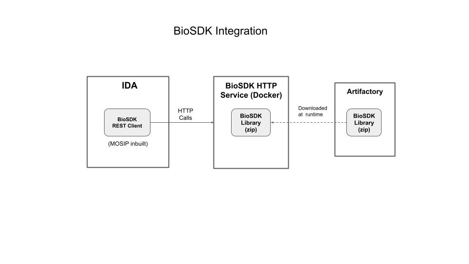

# Bio SDK services

## Introduction

This service provides implementation of IBioAPI over REST. Bio SDK client is used to provide java methods to connect with services. 



## Requirements:
* Java version = 11.X.X
* Maven version >= 3.6

## Run jar directly

### Build

Go to biosdk-services folder and run the below command, this will create a jar file in target folder
```text
mvn clean install
```

### Run jar

```text
java -Dloader.path=<biosdk jar provided by third-party vendors> -Dbiosdk_class=<classpath of class that implements IBioApi interface> -jar biosdk-services-<version>.jar
```

For example:
```text
java -Dloader.path=mock-sdk.jar -Dbiosdk_class=io.mosip.mock.sdk.impl.SampleSDK -jar biosdk-services-1.1.3.jar
```

### Check service status
```text
http://{host}:9099/biosdk-service

In case of localhost:
http://localhost:9099/biosdk-service
```
You will see response like 
```text
Service is running... Fri Jan 29 08:49:28 UTC 2021

```

## Run as docker

### Build docker image

Run the Dockerfile by providing biosdk_jar_path argument where biosdk_jar_path is the url of Bio SDK jar that implements IBioApi interface methods

In case the third party vendor biosdk jar is not hosted, you can change the Dockerfile accordingly  

### Run docker image

Run the docker image by providing biosdk_class as environment variable where biosdk_class is the path of the class that implements IBioApi interface methods

```properties
biosdk_class=<path of the class that implements IBioApi interface methods>
  ```

for example (in case of Mock SDK)
```properties
biosdk_class=io.mosip.mock.sdk.impl.SampleSDK
```

### Check service status
```text
http://{host}:9099/biosdk-service

In case of localhost:
http://localhost:9099/biosdk-service
```
You will see response like 
```text
Service is running... Fri Jan 29 08:49:28 UTC 2021

```

## Swagger UI for exposed APIs
```text
http://{host}:9099/biosdk-service/swagger-ui.html

In case of localhost:
http://localhost:9099/biosdk-service/swagger-ui.html
